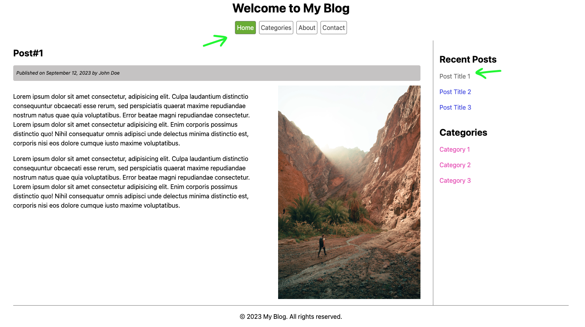

# CHALLENGE #01: SEMANTIC HTML

## Description

- Add hover styles for links
- Create Post#1 layout
- Define navigation

## Specifications

### Links hover

#### Top navbar items

- font color: white
- background color:
  - rgb `(114, 182, 43)`
  - hex `72B62B`

#### Recent navbar items

- font color
  - rgb : `(82, 82, 233)`
  - hex : `5252E9`
- border color: same as font

#### Categories navbar items

- font color
  - rgb: 233, 82, 190
  - hex: E952BE
- border color: same as font

### Post#1 layout

- title: update title with post name
- content: use Lorem Ipsum generator
- image:show image in expected position
- link: disable link for current post

### Navigation

- Home link: navigate to Home
- Post#1 link: navigate to linked post

