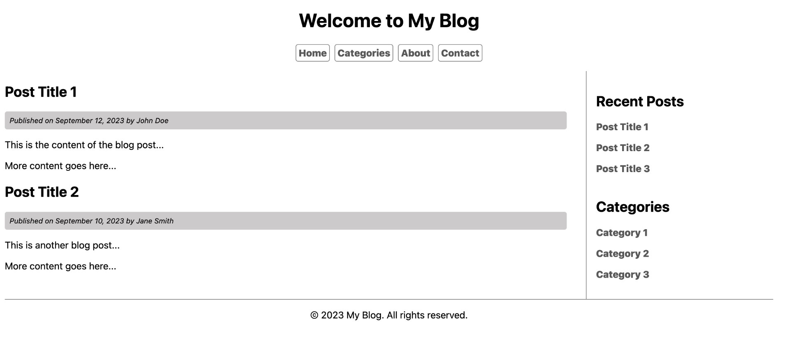

# CHALLENGE #00: SEMANTIC HTML

## Why semantic HTML?

- because it makes code **easier** to understand, making the source code more readable for other developers.
- because screen readers and browsers can interpret Semantic HTML better, which makes it **more accessible**.
- because it affects page's **SEO**, giving it a better ranking on search engines weighing the most important content appropriately.

## Challenge

- Define HTML structure to reproduce the provided prototype. Evaluate which are the best HTML tags in order to ensure an acurated semantic structure.
- Define basic CSS styles to adapt HTML structure to prototype layout.

## Delivery

This challenge must contain two files:

1. `index.html`
2. `css.html`

## Prototype

